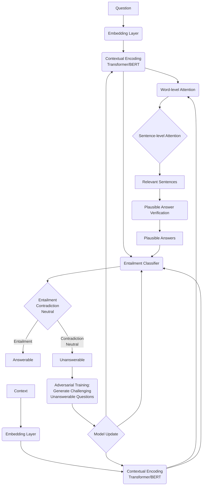
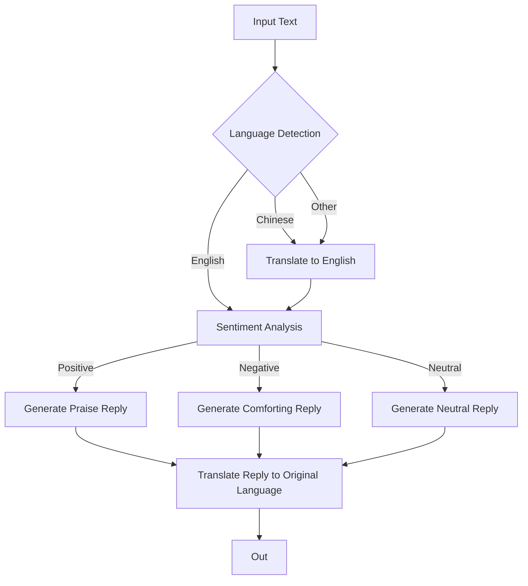

# DS595 NLP Assignment3

**Name:** Xinyi Fang

**Email:** xfang1@wpi.edu

### Task1. Implement a question-answering model

> for detailed code of this task please see *QA_model.py*

For this task, I directly utilized the pre-trained model "bert-large-uncased-whole-word-masking-finetuned-squad". The reason is that this model has already been fine-tuned on the SQuAD benchmark, which aligns well with our question-answering task. Leveraging this model allows us to take advantage of the pre-trained knowledge and achieve better performance.

The implementation process can be summarized as follows:

1. Load the pre-trained BERT tokenizer and model using the transformers library.
2. Read the SQuAD dev dataset from the JSON file and extract the necessary information, including question IDs, questions, and corresponding contexts.
3. Iterate through each question-context pair and perform the following steps:
   - Tokenize the question and context using the BERT tokenizer.
   - If the total number of tokens exceeds 512 (BERT's maximum sequence length):
     - Split the input into chunks of 512 tokens.
     - For each chunk, predict the start and end scores using the BERT model.
     - Keep track of the chunk with the highest combined start and end scores.
   - Else, directly predict the start and end scores using the BERT model.
4. Extract the answer based on the predicted start and end scores, taking into account subword tokens.
5. Store the predicted answer for each question in a dictionary, with the question ID as the key, and save them to a JSON file.

**Experimental Results and Analysis:**

The final evaluation results of the implemented question-answering model are as follows:

{
"exact": 37.7495157079087,
<u>"f1": 42.4848216678163</u>,
"total": 11873,
"HasAns_exact": 75.33738191632928,
"HasAns_f1": 84.8215734922373,
"HasAns_total": 5928,
"NoAns_exact": 0.2691337258200168,
"NoAns_f1": 0.2691337258200168,
"NoAns_total": 5945
}

Interestingly, the current implementation is an improved version compared to a previous approach where tokens were directly truncated if their length exceeded 512. Although truncation seems to be a suboptimal method, the evaluation results showed a slightly higher F1 score compared to the current implementation:

{
"exact": 37.976922429040684,
<u>"f1": 42.75150601300579</u>,
"total": 11873,
"HasAns_exact": 75.82658569500674,
"HasAns_f1": 85.38944515729044,
"HasAns_total": 5928,
"NoAns_exact": 0.23549201009251472,
"NoAns_f1": 0.23549201009251472,
"NoAns_total": 5945
}

One possible explanation for this observation is that the local optima within each chunk may overshadow the global optimum. However, it is also possible that the questions and answers in the SQuAD dataset exhibit specific patterns or distributions that align better with the truncation method, resulting in slightly improved performance. It is worth noting that the chunk-based approach may perform better on other datasets.

Due to time constraints, only these two methods were explored in this assignment. In future work, I plan to investigate alternative approaches, such as using a sliding window to maintain a consistent chunk size of 512 tokens. This method ensures continuity of information at the connection points but may require more computational time. Additionally, I could explore other techniques for selecting the global optimum and evaluate the model's performance on different datasets.

### Task 2. Unanswerable question detection

**Hypothesis and Motivation:**
Inspired by the SQUADRUN paper, which highlights the limitations of existing reading comprehension datasets and models in dealing with unanswerable questions, I hypothesize that the key to identifying unanswerable questions lies in measuring the relevance and entailment between the question and the given context. An answerable question should have high semantic similarity with a specific part of the context that entails or contains the answer. In contrast, an unanswerable question may have keywords that appear in the context, but there is no entailment relationship between any context chunk and the question.

Therefore, by applying hierarchical attention mechanisms to capture question-context interactions at both word and sentence level, introducing a plausible answer verification step, and leveraging entailment classification, the proposed UPAD (Unanswerable Question and Plausible Answer Detection) model can effectively distinguish answerable and unanswerable questions.

**Model Design:**

The UPAD model consists of the following components:

- Embedding Layer:
  
  - Uses pre-trained word embeddings (e.g., GloVe) to convert question and context words into dense vectors.
  - Applies character-level CNN or LSTM to capture morphological features.
  - Concatenates word and character embeddings.

- Contextual Encoding Layer:
  
  - Uses Transformer or BERT to encode question and context sequences separately, capturing long-range dependencies and contextual information.

- Word-level Attention Layer:
  
  - Computes attention scores between each question word and context word using additive attention or dot product attention.
  - Obtains question-aware context representation and context-aware question representation.

- Sentence-level Attention Layer:
  
  - Splits context into sentences.
  - Uses Transformer or BERT to encode each sentence.
  - Computes attention scores between question representation and each sentence representation.
  - Identifies the most relevant sentences to the question.

- Plausible Answer Verification:
  
  - Within the attended sentences, identifies phrases that best match the expected answer type of the question.
  - Treats these phrases as "plausible answers" and concatenates them with the question and full context.
  - Computes relevance scores between the plausible answers and the question to capture the entailment relationship.

- Entailment Classifier:
  
  * Concatenates question representation, attended context representation, and plausible answer representations.
  
  * Feeds into a Multi-layer Perceptron (MLP) classifier.
  
  * Classifies as "Entailment", "Contradiction" or "Neutral".
  
  * If "Contradiction" or "Neutral", predicts the question as "Unanswerable", else "Answerable".

Additionally, to enhance the model's robustness, an adversarial training approach is employed by dynamically generating challenging unanswerable questions. The model is trained to correctly identify these adversarial examples.

**key parameter settings:**

Word embedding dimension: 300 (using pretrained GloVe vectors)

Character embedding dimension: 64

Transformer layers:

- Encoder layers: 6
- Decoder layers: 6
- Attention heads: 8
- Hidden size: 512

Transformer dropout rate: 0.1

Plausible Answer Verification:

- Maximum plausible answers per question: 5
- Plausible answer embedding dimension: 512

Entailment Classifier:

- MLP layers: 3
- MLP hidden size: [512, 256, 128]
- MLP activation function: ReLU
- Dropout rate: 0.2

Adversarial question generation frequency: every 5 epochs

Optimizer: Adam

Learning rate: 0.0001

Batch size: 32

Number of epochs: 50

**Evaluation Metrics:**

Accuracy, Precision, Recall, F1 score

The UPAD model aims to push the boundaries of reading comprehension by tackling the challenging task of unanswerable question detection. By combining hierarchical attention, plausible answer verification, entailment classification, and adversarial training, UPAD strives to achieve a deeper understanding of the question-context relationship.

### Task 4. LangChain practice

> for detailed code of this task please see *example1.py*, *example2.py* and *main.py*

##### Part 1. implement two sequential chain

In the first structure, I implemented a sequential chain using the Langchain library to automate a series of language processing tasks on a given input review. The chain includes five steps: translating the review to English, summarizing it, identifying the original language, generating a follow-up message, and translating the follow-up message back to English. By modularizing each task into a separate LLMChain and combining them in a SequentialChain, the workflow becomes customizable and extendable. This implementation showcases how Langchain can be used to orchestrate a sequence of language processing tasks efficiently.

In the second structure, I implemented another sequential chain structure that conditionally processes the input text based on its relevance to a predefined list of subjects. If the input is related to any of the subjects, it goes through a detailed explanation chain; otherwise, it goes through a casual answer chain. The output from the selected chain is then passed to a translation chain (to Chinese) and a summarization chain. This implementation demonstrates how to create a more complex and adaptive sequential chain in Langchain, where the processing path is determined by the content of the input text.

##### Part2. design own sequential chain structure and draw a diagram

In this part, I designed and implemented a custom sequential chain structure for processing text in different languages, performing sentiment analysis, and generating appropriate bilingual responses based on the sentiment. The sentiment analysis is the core of the entire chain, as it determines the system's understanding of and reaction to the input text.

The process includes the following steps:

1. Language Detection: A language_chain is created using LLMChain and PromptTemplate to detect the language of the input text. The llm returns the name of the language.
2. Translation: A translate_chain is created to translate the text into English if the detected language is not English. This step uses ChatPromptTemplate to insert the dynamic language name into the prompt.
3. Sentiment Analysis: A sentiment_chain is created to analyze the sentiment of the English text. This step is crucial as it determines the system's attitude and the tone of the subsequent response. The llm returns Positive, Negative, or Neutral.
4. Generating Bilingual Responses: Based on the sentiment analysis result, a reply_chain is created to generate the appropriate English response. To achieve bilingual output, a backtranslate_chain is also created to translate the English response back to the original language (if the original language is not English). This way, regardless of the input language, the system can provide both an English response and a response in the original language.
5. Integration: All the above chains are integrated into a function called process_text. This function accepts text input and sequentially executes language detection, translation (if needed), sentiment analysis, and bilingual response generation steps. Finally, it returns a dictionary containing the outputs of each step.

To test this custom sequential chain, I prepared two sample texts, one in English and one in Chinese, and passed them into the process_text function. The function successfully processed both texts, correctly detecting the language, performing necessary translations, analyzing the sentiment, and generating appropriate bilingual responses.

Here's an example output for a Chinese sample:

{'english_reply': "It's great to hear that you enjoyed the movie so much! It "
                  'sounds like it had all the elements of a fantastic '
                  'cinematic experience. Thanks for sharing your thoughts and '
                  'recommendation.',
 'english_text': 'The English translation of the Chinese text '
                 '"这部电影拍得真不错,演员演技在线,故事情节也很吸引人,推荐大家去看。" is as follows:\n'
                 '\n'
                 "This movie is really well-made. The actors' performances are "
                 'on point, and the plot is very engaging. I recommend '
                 'everyone to go and watch it.',
 'final_reply': '很高兴听到你如此喜欢这部电影!听起来这部电影具备了所有令人赞叹的电影体验的元素。感谢你分享你的想法和推荐。',
 'language': 'Chinese',
 'original_text': '这部电影拍得真不错,演员演技在线,故事情节也很吸引人,推荐大家去看。',
 'sentiment': 'Positive'}

This custom structure showcases how to use Langchain to create a more complex and adaptive sequential chain that dynamically determines the processing steps and output format based on the language and sentiment of the input text. By modularizing each task and introducing sentiment analysis and bilingual generation, this structure can better understand and respond to user needs, providing a more humane and personalized interaction experience.

